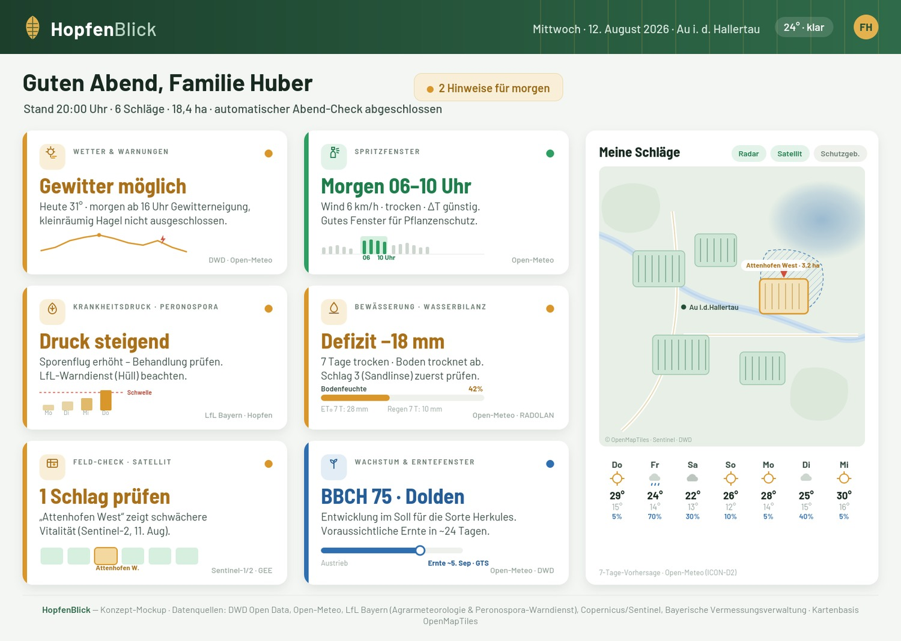
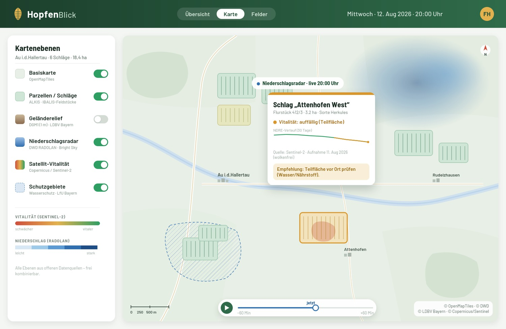
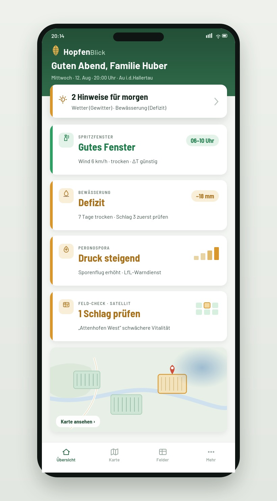
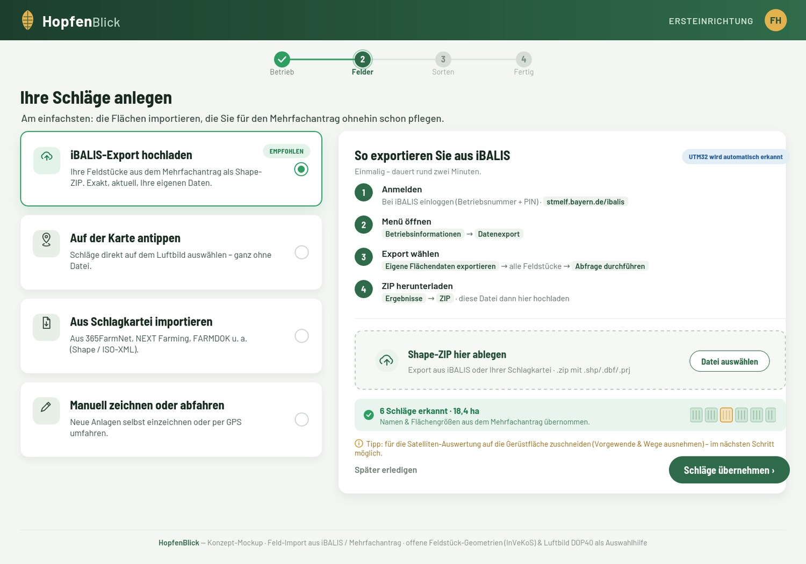

# HopfenBlick

**Konzept für ein webbasiertes Feld-Dashboard im Hopfenbau der Hallertau.**
Offene Satelliten-, Wetter- und Geodaten, gebündelt zu einem täglichen Feld-Check,
der auch für nicht-technische Betriebe nutzbar ist.

> Dieses Repo enthält den aktuellen Konzeptstand: vier gestaltete Mockups und einen
> deutschen Konzeptbericht (PDF). Es ist noch **kein** lauffähiges Produkt, sondern
> die Design- und Inhaltsgrundlage dafür.

## Vorschau

| Übersicht (Desktop) | Karte / Ebenen |
|---|---|
|  |  |

| Mobil | Onboarding (Felder anlegen) |
|---|---|
|  |  |

Der vollständige Bericht liegt unter [`deliverables/HopfenBlick_Report.pdf`](deliverables/HopfenBlick_Report.pdf).

## Inhalt
- `mockups/` — vier Bildschirm-Entwürfe als eigenständiges HTML (Übersicht, Mobil, Karte, Onboarding).
- `report/` — Quelle des Berichts (`report.html`) plus Bilder in `report/img/`.
- `deliverables/` — gerenderte Ausgaben (PNG der Mockups, PDF des Berichts).
- `scripts/stamp_pages.py` — setzt Seitenzahlen ins PDF.
- `build.sh` — baut alles neu.

## Bauen
Voraussetzungen:
- `wkhtmltopdf` (bringt `wkhtmltoimage` mit) — siehe https://wkhtmltopdf.org
- `python3` mit `pymupdf` und `pillow`:  `pip install pymupdf pillow`
- `fontconfig` und `curl`

Dann:
```bash
./build.sh
```
Das Skript lädt die Schrift **Barlow** (SIL Open Font License), rendert die Mockups
nach `deliverables/*.png` und den Bericht nach `deliverables/HopfenBlick_Report.pdf`.

> Hinweis zur Engine: `wkhtmltoimage`/`wkhtmltopdf` nutzt eine ältere WebKit-Engine.
> Beim Bearbeiten der Mockups gelten daher CSS-Einschränkungen (kein Flexbox/Grid,
> absolute Positionierung, inline SVG). Details in [`CLAUDE.md`](CLAUDE.md).

## Datenquellen (Konzept)
Open-Meteo · DWD (über Bright Sky) · LfL Bayern (Agrarmeteorologie & Peronospora-Warndienst) ·
Copernicus/Sentinel · bayerische Geobasisdaten (DGM1, DOP40, ALKIS-Parzellarkarte) ·
iBALIS / InVeKoS-Feldstückkarte für den Feld-Import. Quellen und Lizenzhinweise stehen
im Bericht (Kapitel 3, 4 und Anhang).

## Status & nächste Schritte
Konzept + Mockups stehen. Naheliegend als Nächstes: mobile Onboarding-Variante,
ein „auf Gerüstfläche zuschneiden"-Screen sowie ein erster lauffähiger Prototyp
(MapLibre-Frontend + kleine API mit Caching). Siehe `CLAUDE.md`.

## Lizenz
Dieses Projekt steht unter der **GPL-3.0** (siehe [`LICENSE`](LICENSE)). Beachte
separat: die Schrift **Barlow** steht unter der **SIL OFL**, und die genannten
**Datenquellen** (DWD, Open-Meteo, LfL, Copernicus, bayerische Geobasisdaten, iBALIS/InVeKoS)
haben jeweils **eigene Nutzungsbedingungen**, die unabhängig von der Projektlizenz gelten.

---
*HopfenBlick ist ein Arbeitstitel; Gestaltung und Beispielwerte dienen der Veranschaulichung.*
